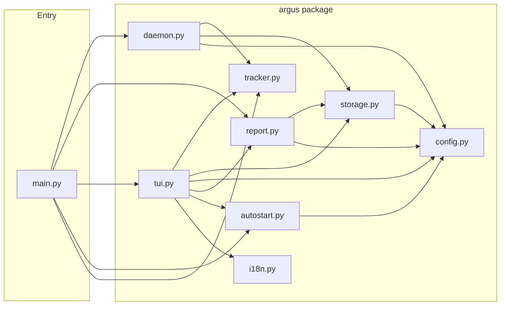
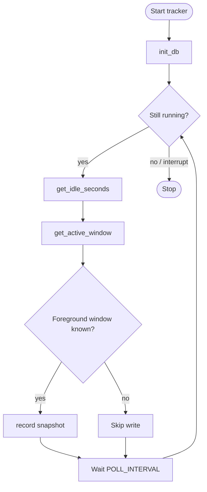

# Argus

**README の言語：** [English](README.md) · 日本語 · [中文](README.zh.md)

> *ギリシャ神話の百眼の巨人アルゴス・パノプテスにちなんで命名。眠らず、すべてを見守り続けた。*

> *シンプルな問いから始まった6ヶ月のソロプロジェクト：私の時間は何処へ向かっているのか？*

Argus は5秒ごとに使っていたアプリをそっと記録します — プロンプトなし、エラーなし。後でダッシュボードを開けば、まる1日の行動が清清楚楚わかります。

**クラウドなし。アカウントなし。追跡なし。 — あなたのデータ在你的电脑上，哪儿也不去。**

## TUI とは？

TUI は **Text-based User Interface（テキストベースのユーザーインターフェース）** の略です。ボタンやウィンドウの代わりに、プレーンテキストと文字だけで画面を描画し、ターミナルの中で直接使えます。要するに、 командной строке живущая прибор板のようなものです — GUI のウィンドウは不要です。

Argus にとってこれは重要：1つのコマンド（`argus tui`）でトラッカーとダッシュボードの両方を同時に起動でき、バックグラウンドサービスの設定が不要です。軽量でキーボードだけで操作できます。

## 機能

- **5秒ごと** — 使っているアプリ、ウィンドウタイトル、時刻を記録（バックグラウンドで静かに）
- **自動分類** — ブラウザ、IDE、コミュニケーション、ゲーム、メディアなどにグループ化
- **ローカル保存のみ** — データは SQLite ファイルとして电脑に保存；外部送信なし
- **クロスプラットフォーム** — Windows、Linux 対応

## Screenshots

スクリーンショットは [English README](README.md#screenshots) を参照してください。

---

## 設計の視点

```
要件定義 → システム基本設計 → システム詳細設計
```

---

### 要件定義

**システムの機能：**

| # | 機能 | 詳細 |
|---|---|---|
| R1 | アクティブウィンドウを追跡 | 5秒間隔で静かに記録 |
| R2 | アプリを自動分類 | ブラウザ、IDE、ターミナル、チャットなど — 11カテゴリ |
| R3 | データをローカル保存 | SQLite ファイル、アカウント不要 |
| R4 | TUI がトラッカーも実行 | `argus tui` でダッシュボードとトラッカーを同時に起動 — デーモン不要 |
| R5 | ログイン時に自動起動 | OS 別対応、有効化コマンド1つ |
| R6 | UI 6言語対応 | TUI 内で `L` キーを押して切り替え |
| R7 | カラーテーマ12種 | TUI 内で `T` キーを押して切り替え |

**システムの品質：**

| # | 品質 | 詳細 |
|---|---|---|
| R8 | プライバシー | データはすべて电脑に保存 — ネットワーク通信ゼロ |
| R9 | クロスプラットフォーム | Windows、Linux |
| R10 | 軽量 | 通常のデスクトップ使用で CPU 使用率 1% 未満 |
| R11 | アイドル検出 | 離席時は記録を一時停止 |
| R12 | 小さなストレージ | 5秒間隔で1行のみ |
| R13 | モジュール式 | 明確なレイヤー分離でメンテナンスしやすい |

---

### システム基本設計

**三層アーキテクチャ：**

```
┌──────────────────────────────────────────────┐
│  UI 層: TUI (Textual) + レポート (Rich)       │
├──────────────────────────────────────────────┤
│  サービス層: トラッカー、ストレージ、レポート    │
├──────────────────────────────────────────────┤
│  プラットフォーム層: Win32 / Linux     │
└──────────────────────────────────────────────┘
```

- **UI 層** — TUI はライブダッシュボード（Textual 駆動）。レポートは静的なテキスト出力（Rich 駆動）。
- **サービス層** — トラッカーは哪个ウィンドウがアクティブかチェック。ストレージは SQLite にスナップショットを保存。レポートがサマリーを生成。
- **プラットフォーム層** — 各 OS ごとにアクティブウィンドウとアイドル状態を検出するコード。

**プロジェクト構成：**

```
src/
├── main.py               # CLI エントリポイント — argus/ に委譲
└── argus/
    ├── __init__.py       # バージョン
    ├── config.py         # 定数、カテゴリルール、設定
    ├── i18n.py           # UI 文字列（6言語）
    ├── tracker.py        # アクティブウィンドウ + アイドル検出（OS 別）
    ├── storage.py        # SQLite 読み書き
    ├── daemon.py         # バックグラウンドポーリングループ
    ├── report.py         # 日次 / 週次 / ステータスレポート
    ├── tui.py            # ライブダッシュボード
    └── autostart.py      # ログイン自動起動（OS 別）
build.py                  # PyInstaller ビルドスクリプト → dist/argus[.exe]
requirements.txt          # ランタイム依存関係
requirements-dev.txt     # ランタイム + ビルドツール
dist/                    # コンパイル済み実行ファイル（.gitignore 済み）
```

**技術スタック：**

| Concern | ツール |
|---|---|
| アクティブウィンドウ検出 | `pywin32`（Windows）· `xdotool`（Linux）|
| アイドル検出 | Windows API / `xprintidle` |
| ストレージ | SQLite（標準ライブラリ `sqlite3`）|
| CLI | `Typer` |
| レポート | `Rich` |
| ライブダッシュボード | `Textual` |

**アプリのカテゴリ：** `ブラウザ` · `IDE / エディタ` · `ターミナル` · `コミュニケーション` · `デザイン` · `ゲーム` · `生産性` · `メディア` · `ファイルマネージャー` · `システム` · `その他`

マッピングを変更するには `argus/config.py` の `CATEGORIES` を編集してください。

**アーキテクチャ図**（GitHub で自動描画）：

*モジュール構造 — `main.py` が各 `argus/` モジュールに委譲：*



*アクティビティ — トラッキングループ：*



---

### システム詳細設計

**保存されるデータ** — `~/.argus/argus.db` に5秒ごとのスナップショットが1行：

| カラム | 型 | 意味 |
|---|---|---|
| `ts` | REAL | Unix タイムスタンプ |
| `app_name` | TEXT | プロセス名（例：`chrome`、`code`）|
| `window_title` | TEXT | その時点のウィンドウタイトル |
| `exe_path` | TEXT | 実行ファイルのフルパス |
| `idle` | INTEGER | アイドルしきい値を超えた場合 1 |

アイドルのスナップショットはレポートと TUI でデフォルト除外されます。ユーザー設定（言語、テーマ）は `~/.argus/settings.json` に別途保存されます。

**設定定数** `argus/config.py` 内：

```python
POLL_INTERVAL  = 5    # スナップショットの間隔（秒）
IDLE_THRESHOLD  = 60   # アイドルとみなす無操作時間（秒）
```

**TUI — キーボードショートカット：**

| キー | 動作 |
|---|
| `R` | 全データを今すぐ更新 |
| `T` | カラーテーマを切り替え |
| `L` | 表示言語を切り替え（6言語）|
| `A` | 自動起動の切り替え |
| `O` | データフォルダを開く |
| `[` `]` | 前日 / 翌日 |
| `{` `}` | 前週 / 翌週 |
| `Q` | 終了 |

`argus tui` を実行すると [Textual](https://textual.textualize.io/) による全画面リアルタイムダッシュボードが開きます。トラッカーもバックグラウンドで同時起動するため、別途 `start` は不要です。

**TUI の表示内容：**

- **ステータスパネル** — アクティブなアプリ、カテゴリ、ウィンドウタイトル、アイドル時間、スナップショット数
- **今日** — 上位10アプリとカテゴリ内訳（進捗バー付き）
- **今週** — 日別サマリー表と週次上位アプリ・カテゴリ

TUI は5秒ごとに自動更新されます。

6言語： `en` · `ja` · `zh` · `fr` · `de` · `es`

12テーマ： `textual-dark` · `textual-light` · `nord` · `gruvbox` · `catppuccin-mocha` · `catppuccin-latte` · `dracula` · `tokyo-night` · `monokai` · `solarized-dark` · `solarized-light` · `flexoki`

言語とテーマの選択は自動的に保存・復元されます。

---

## Origin Story — 開発のきっかけ

半年前のことでした。

僕はちょうど —— フルタイムの仕事、フリーランスの案件、勉学 —— という過密な時期を終えたばかりでした。ある夜、自分にシンプルな問いを投げかけました：**自分の時間は何処へ向かっているのか？**

記憶しようとした。ノートを取ろうとした。うまくいかない。問題は努力ではなかった —— 見えないことこそが问题だった。改善しようにも測定できなければ、コンピュータでの作業時間を正確に思い出すことはできない。

そこで Argus を作りました。

タスク管理ツールでも、ポモドーロタイマーでもありません。**受動的な鏡**として、5秒ごとに做了什么を記録し、後から真実を見られるようにしました。

**既にあるツールでいいのでは？** RescueTime、ActivityWatch、Toggl —— どれも试しました。でもそれぞれに避けたいものがあった：クラウド依存、订阅费用、Linuxの不十分なサポート、ターミナル対応の欠如。ローカルで、永遠に、摩擦なく動くものが欲しかった。Argus はまさにそのツールです。

**開発から学んだこと：** 制約こそが機能だった。早朝や週末の隙間時間を使って作ったため、過度な設計はできませんでした。シンプルさは妥协ではなく哲学になりました。

---

## ダウンロード

### Linux

最新バージョンは [GitHub Releases ページ](https://github.com/boycececil666gmailcom/t1-pub-argus/releases/latest) からダウンロードできます。

```bash
# 例：ダウンロードして実行（X.Y.Z を最新バージョンに置き換えてください）
curl -L https://github.com/boycececil666gmailcom/t1-pub-argus/releases/download/vX.Y.Z/argus -o argus
chmod +x argus
./argus tui
```

> **事前にインストールが必要なシステムパッケージ：**
> - Ubuntu / Debian: `sudo apt install xdotool xprintidle`
> - Fedora: `sudo dnf install xdotool xprintidle`

---

## Quickstart

### Windows

```bash
# Download dist/argus.exe and run
argus.exe tui
```

### Linux

```bash
# Install system dependencies first
sudo apt install xdotool xprintidle   # Ubuntu / Debian
sudo dnf install xdotool xprintidle   # Fedora

# Download dist/argus and run
./argus tui
```

### 次にやること

```bash
argus tui        # インタラクティブダッシュボード（推奨）
argus report     # ターミナル内のテキストレポート

# 特定の日を表示
argus report --date 2026-04-05

# 今週のレポートを表示
argus week

# 今していることをチェック
argus status

# ログイン時に自動起動
argus install    # 自動起動を有効化
argus uninstall  # 自動起動を無効化
```
