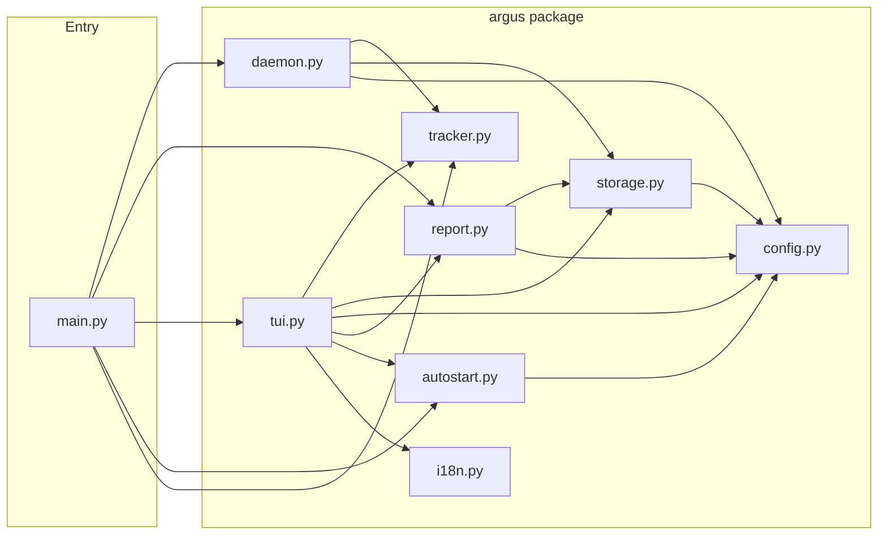
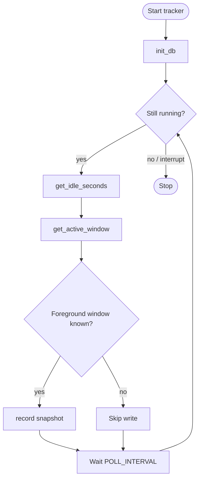

# Argus

**README languages:** English · [日本語](README.ja.md) · [中文](README.zh.md)

> *Named after Argus Panoptes — the hundred-eyed giant of Greek mythology who never slept and watched everything.*

> *A six-month solo project born from a simple question: where does my time actually go?*

Argus quietly records which app you're using every 5 seconds — no prompts, no effort. Open the dashboard later to see exactly where your hours went.

**No cloud. No account. No tracking — of you. Your data stays on your machine.**

## What is TUI?

TUI stands for **Text-based User Interface**. Instead of buttons and windows, it draws an interactive interface using plain text and characters, right inside your terminal. Think of it like a dashboard that lives in your command-line — no GUI window needed.

For a system like Argus, this matters: it means one command (`argus tui`) starts both the tracker and the dashboard at the same time, no background service setup required. It's lightweight and keyboard-driven.

## Features

- **Every 5 seconds** — records the active app, window title, and timestamps silently in the background
- **Auto-categorises** — groups time into Browser, IDE, Communication, Gaming, Media, and more
- **Local-only** — all data stored in a simple SQLite file on your computer; nothing sent anywhere
- **Cross-platform** — works on Windows and Linux

## Screenshots
Functional screenshots


Theme changes


---

## Design rationale

```
Requirements Definition → Basic System Design → Detailed System Design
```

---

### Requirements Definition

**What it does:**

| # | Feature | Details |
|---|---|---|
| R1 | Tracks your active window | Every 5 seconds, silently |
| R2 | Auto-categorises apps | Browser, IDE, Terminal, Chat, etc. — 11 categories |
| R3 | Stores data locally | SQLite file, no server, no account |
| R4 | TUI runs the tracker too | `argus tui` starts both dashboard and tracker — no daemon needed |
| R5 | Auto-starts on login | OS-specific, one command to enable |
| R6 | 6 UI languages | Press `L` in the TUI to switch |
| R7 | 12 colour themes | Press `T` in the TUI to cycle |

**How well it behaves:**

| # | Quality | Details |
|---|---|---|
| R8 | Privacy | All data stays on your machine — zero network calls |
| R9 | Cross-platform | Windows, Linux |
| R10 | Lightweight | Uses less than 1% CPU on normal desktop use |
| R11 | Idle detection | Pauses recording when you're away |
| R12 | Small storage | One row per 5-second snapshot |
| R13 | Modular | Clean layer separation for easy maintenance |

---

### Basic System Design

**Three layers:**

```
┌─────────────────────────────────────────────┐
│  UI layer: TUI (Textual) + Reports (Rich)   │
├─────────────────────────────────────────────┤
│  Service layer: Tracker, Storage, Report    │
├─────────────────────────────────────────────┤
│  Platform layer: Win32 / Linux      │
└─────────────────────────────────────────────┘
```

- **UI layer** — TUI is the live dashboard (powered by Textual). Reports are static text printouts (powered by Rich).
- **Service layer** — Tracker checks what window is active. Storage saves snapshots to SQLite. Report generates summaries.
- **Platform layer** — Platform-specific code for each OS to detect active windows and idle state.

**Project structure:**

```
src/
├── main.py               # CLI entry point — delegates to argus/
└── argus/
    ├── __init__.py       # version
    ├── config.py         # constants, category rules, settings
    ├── i18n.py           # UI strings (6 languages)
    ├── tracker.py        # active window + idle detection (per OS)
    ├── storage.py        # SQLite read/write
    ├── daemon.py         # background polling loop
    ├── report.py         # daily/weekly/status reports
    ├── tui.py            # live dashboard
    └── autostart.py      # login auto-start (per OS)
build.py                  # PyInstaller build script → dist/argus[.exe]
requirements.txt          # runtime dependencies
requirements-dev.txt      # runtime + build tools
dist/                     # compiled executables (git-ignored)
```

**Tech stack:**

| Concern | Tool |
|---|---|
| Active window detection | `pywin32` (Windows) · `xdotool` (Linux) |
| Idle detection | Windows API / `xprintidle` |
| Storage | SQLite via stdlib `sqlite3` |
| CLI | `Typer` |
| Reports | `Rich` |
| Live dashboard | `Textual` |

**App categories:** `Browser` · `IDE / Editor` · `Terminal` · `Communication` · `Design` · `Gaming` · `Productivity` · `Media` · `File Manager` · `System` · `Other`

Edit `CATEGORIES` in `argus/config.py` to add or change mappings.

**Architecture diagrams** (rendered on GitHub):

*Module structure — `main.py` delegates to each `argus/` module:*



*Activity — tracking loop:*



---

### Detailed System Design

**Data stored** — one row per 5-second snapshot in `~/.argus/argus.db`:

| Column | Type | Meaning |
|---|---|---|
| `ts` | REAL | Unix timestamp |
| `app_name` | TEXT | Process name (e.g. `chrome`, `code`) |
| `window_title` | TEXT | Window title at that moment |
| `exe_path` | TEXT | Full path to the executable |
| `idle` | INTEGER | 1 if no keyboard/mouse input for longer than the idle threshold |

Idle snapshots are excluded from reports and the TUI by default. User preferences (language, theme) are stored separately in `~/.argus/settings.json`.

**Tuning constants** in `argus/config.py`:

```python
POLL_INTERVAL  = 5    # seconds between snapshots
IDLE_THRESHOLD  = 60   # seconds of no input before marking idle
```

**TUI — Keyboard shortcuts:**

| Key | Action |
|---|
| `R` | Refresh data immediately |
| `T` | Cycle through colour themes |
| `L` | Cycle through UI languages (6 languages) |
| `A` | Toggle Auto Start |
| `O` | Open the data folder |
| `[` `]` | Previous / next day |
| `{` `}` | Previous / next week |
| `Q` | Quit |

`argus tui` opens a live full-terminal dashboard powered by [Textual](https://textual.textualize.io/). It also runs the tracker in the background — no separate `start` command needed.

**What the TUI shows:**

- **Status panel** — active app, category, window title, idle time, snapshot count
- **Today** — top 10 apps and category breakdown with progress bars
- **This Week** — day-by-day summary table plus weekly top apps and categories

The TUI auto-refreshes every 5 seconds.

6 languages: `en` · `ja` · `zh` · `fr` · `de` · `es`

12 themes: `textual-dark` · `textual-light` · `nord` · `gruvbox` · `catppuccin-mocha` · `catppuccin-latte` · `dracula` · `tokyo-night` · `monokai` · `solarized-dark` · `solarized-light` · `flexoki`

Your language and theme choices are saved and restored automatically.

---

## Origin Story

Six months ago, I had just finished a brutal stretch — full-time job, freelance work, and study all at once. One night I asked myself a simple question: **where did my time actually go?**

I tried remembering. I tried taking notes. Neither stuck. The problem wasn't effort — it was invisibility. You can't fix what you can't see, and time on a computer is nearly impossible to recall accurately.

So I built Argus.

Not a to-do list. Not a Pomodoro timer. A **passive mirror** that records what you do every 5 seconds, then lets you look back and see the truth.

**Why not use an existing tool?** RescueTime, ActivityWatch, Toggl — I tried them. Each had something I didn't want: cloud dependency, subscription fees, poor Linux support, or no terminal interface. I wanted something that ran locally, forever, without friction. Argus is that tool.

**What I learned building it:** the constraint was the feature. Building in stolen hours — early mornings, weekends — meant I couldn't over-engineer. Simplicity became a philosophy, not a compromise.

---

## Downloads

### Linux

Download the latest release from the [GitHub Releases page](https://github.com/boycececil666gmailcom/t1-pub-argus/releases/latest).

```bash
# Example: download and run (replace X.Y.Z with the latest version)
curl -L https://github.com/boycececil666gmailcom/t1-pub-argus/releases/download/vX.Y.Z/argus -o argus
chmod +x argus
./argus tui
```

> **System dependencies required** (install before running Argus for the first time):
> - Ubuntu / Debian: `sudo apt install xdotool xprintidle`
> - Fedora: `sudo dnf install xdotool xprintidle`

---

## Quickstart

### Windows

```bash
# Download dist/argus.exe and run
argus.exe tui
```

### Linux

```bash
# Install system dependencies first
sudo apt install xdotool xprintidle   # Ubuntu / Debian
sudo dnf install xdotool xprintidle   # Fedora

# Download dist/argus and run
./argus tui
```

### What to do next

```bash
argus tui        # Interactive dashboard (recommended)
argus report     # Text report in terminal

# View specific day
argus report --date 2026-04-05

# View this week's report
argus week

# Check what you're doing right now
argus status

# Auto-start on login
argus install    # Enable auto-start
argus uninstall  # Disable auto-start
```
