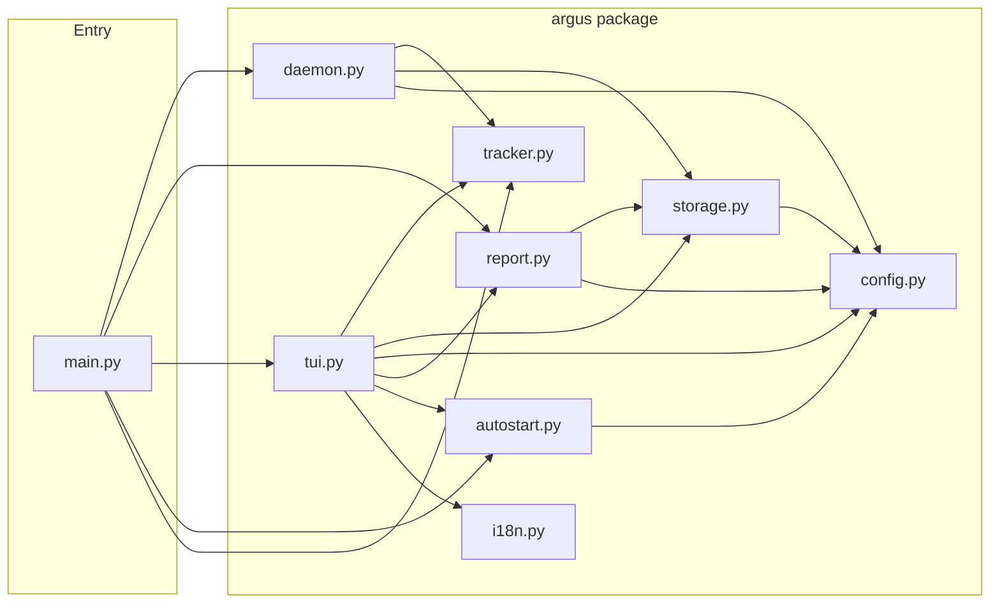
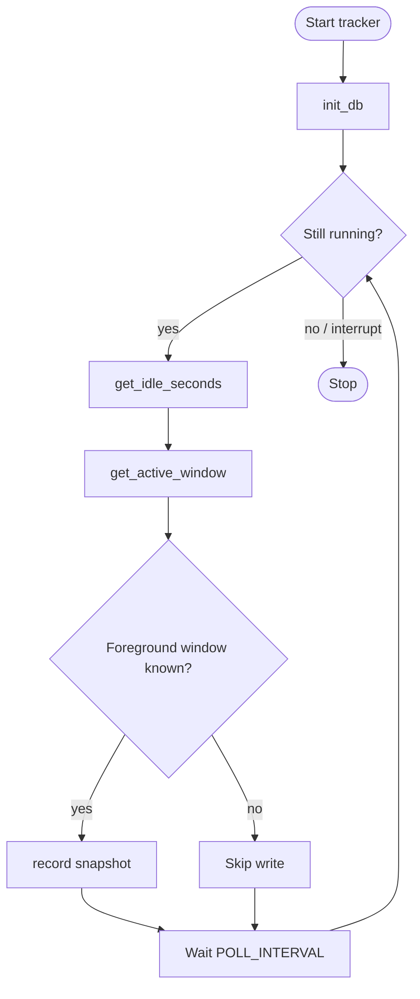
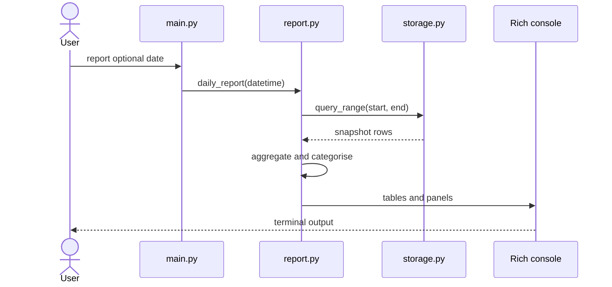
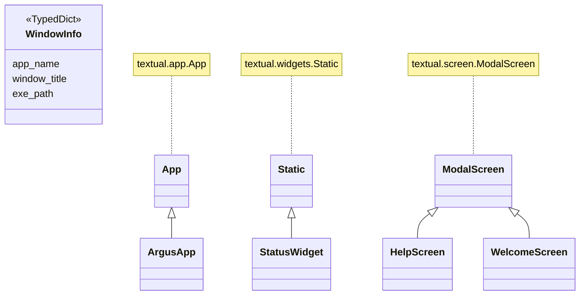

# Argus

**README 语言：** [English](README.md) · [日本語](README.ja.md) · 中文

> *以希腊神话中百眼巨人 Argus Panoptes 命名——他从不安睡，时刻注视着一切。*

> *一个简单的问题，开启了六个月的独立开发之旅：我的时间究竟去了哪里？*

Argus 每 5 秒默默记录你正在使用的应用 —— 无需提示，无需操作。之后打开仪表盘，就能清楚地看到时间都花在了哪里。

**无云端。无账号。不追踪你。只追踪数据。数据永远留在你自己的电脑上。**

## 什么是 TUI？

TUI 是 **Text-based User Interface（文本用户界面）** 的缩写。它用纯文本和字符在终端内绘制交互界面，不需要按钮或窗口。把它想象成一个住在命令行里的仪表盘 —— 无需独立的 GUI 窗口。

对于 Argus 这样的系统来说，这意味着：一条命令（`argus tui`）同时启动追踪器和仪表盘，无需任何后台服务配置。轻量、快速、全键盘操作。

## 功能

- **每 5 秒** — 记录当前应用、窗口标题和时间戳，后台静默运行
- **自动分类** — 将时间归入浏览器、IDE、通讯、游戏、媒体等分类
- **仅本地存储** — 数据保存在电脑上的 SQLite 文件中，不上传到任何地方
- **跨平台** — 支持 Windows、Linux

## Screenshots

Screenshots are available in the [English README](README.md#screenshots).

---

## 设计视角

```
需求定义 → 系统基本设计 → 系统详细设计
```

---

### 需求定义

**系统做什么：**

| # | 功能 | 详情 |
|---|---|---|
| R1 | 追踪前台窗口 | 每 5 秒静默记录 |
| R2 | 自动分类应用 | 浏览器、IDE、终端、聊天等 — 11 个分类 |
| R3 | 本地存储数据 | SQLite 文件，无需服务器，无需账号 |
| R4 | TUI 同时运行追踪器 | `argus tui` 同时启动仪表盘和追踪器，无需独立守护进程 |
| R5 | 登录时自动启动 | 各系统对应，一条命令启用 |
| R6 | 6 种界面语言 | 在 TUI 中按 `L` 切换 |
| R7 | 12 套配色主题 | 在 TUI 中按 `T` 切换 |

**系统做得怎么样：**

| # | 品质 | 详情 |
|---|---|---|
| R8 | 隐私保护 | 所有数据留在你电脑上 — 零网络请求 |
| R9 | 跨平台 | Windows、Linux |
| R10 | 轻量 | 普通桌面使用下 CPU 占用低于 1% |
| R11 | 空闲检测 | 你离开时自动暂停记录 |
| R12 | 低存储开销 | 每 5 秒仅一行数据 |
| R13 | 模块化 | 层次清晰，易于维护 |

---

### 系统基本设计

**三层架构：**

```
┌──────────────────────────────────────────────┐
│  UI 层: TUI (Textual) + 报告 (Rich)          │
├──────────────────────────────────────────────┤
│  服务层: 追踪器、存储、报告                    │
├──────────────────────────────────────────────┤
│  平台层: Win32 / Linux               │
└──────────────────────────────────────────────┘
```

- **UI 层** — TUI 是实时仪表盘（由 Textual 驱动）。报告是静态文本输出（由 Rich 驱动）。
- **服务层** — 追踪器负责检测哪个窗口处于活跃状态。存储负责将快照保存到 SQLite。报告负责生成汇总。
- **平台层** — 各操作系统特定的代码，用于检测活跃窗口和空闲状态。

**项目结构：**

```
src/
├── main.py               # CLI 入口 — 委托给 argus/
└── argus/
    ├── __init__.py       # 版本号
    ├── config.py         # 常量、分类规则、设置
    ├── i18n.py           # 界面字符串（6 种语言）
    ├── tracker.py        # 活跃窗口 + 空闲检测（各系统）
    ├── storage.py        # SQLite 读写
    ├── daemon.py         # 后台轮询循环
    ├── report.py         # 日报 / 周报 / 状态报告
    ├── tui.py            # 实时仪表盘
    └── autostart.py      # 开机自启（各系统）
build.py                  # PyInstaller 构建脚本 → dist/argus[.exe]
requirements.txt          # 运行时依赖
requirements-dev.txt     # 运行时 + 构建工具
dist/                    # 编译产物（已加入 .gitignore）
```

**技术栈：**

| Concern | 工具 |
|---|---|
| 活跃窗口检测 | `pywin32`（Windows）· `xdotool`（Linux）|
| 空闲检测 | Windows API / `xprintidle` |
| 存储 | SQLite（标准库 `sqlite3`）|
| CLI | `Typer` |
| 报告 | `Rich` |
| 实时仪表盘 | `Textual` |

**应用分类：** `浏览器` · `IDE / 编辑器` · `终端` · `通讯` · `设计` · `游戏` · `生产力` · `媒体` · `文件管理器` · `系统` · `其他`

修改分类映射请编辑 `argus/config.py` 中的 `CATEGORIES`。

**架构图**（GitHub 原生渲染）：

*模块结构 — `main.py` 委托给各 `argus/` 模块：*



*活动图 — 追踪循环：*



*序列图 — `report` 命令：*



*类图 — `WindowInfo` TypedDict 和 TUI 组件层级：*



---

### 系统详细设计

**存储的数据** — `~/.argus/argus.db` 中每 5 秒快照对应一行：

| 字段 | 类型 | 含义 |
|---|---|---|
| `ts` | REAL | Unix 时间戳 |
| `app_name` | TEXT | 进程名（如 `chrome`、`code`）|
| `window_title` | TEXT | 当时的窗口标题 |
| `exe_path` | TEXT | 可执行文件完整路径 |
| `idle` | INTEGER | 超过空闲阈值时为 1 |

空闲快照在报告和 TUI 中默认排除。用户偏好（语言、主题）单独存储于 `~/.argus/settings.json`。

**调优常量** `argus/config.py` 内：

```python
POLL_INTERVAL  = 5    # 快照间隔（秒）
IDLE_THRESHOLD  = 60   # 标记为空闲的无操作时长（秒）
```

**TUI — 键盘快捷键：**

| 按键 | 功能 |
|---|
| `R` | 立即刷新所有数据 |
| `T` | 切换颜色主题 |
| `L` | 切换界面语言（6 种语言）|
| `A` | 切换自动启动 |
| `O` | 打开数据文件夹 |
| `[` `]` | 上一天 / 下一天 |
| `{` `}` | 上一周 / 下一周 |
| `Q` | 退出 |

运行 `argus tui` 打开由 [Textual](https://textual.textualize.io/) 驱动的全终端实时仪表盘，同时在后台运行追踪器，无需单独执行 `start`。

**TUI 显示内容：**

- **状态面板** — 当前应用、分类、窗口标题、空闲时间、快照总数
- **今日** — 前 10 个应用及分类占比（含进度条）
- **本周** — 逐日汇总、每周分类分布、每周热门应用

TUI 每 5 秒自动刷新。

6 种语言： `en` · `ja` · `zh` · `fr` · `de` · `es`

12 套主题： `textual-dark` · `textual-light` · `nord` · `gruvbox` · `catppuccin-mocha` · `catppuccin-latte` · `dracula` · `tokyo-night` · `monokai` · `solarized-dark` · `solarized-light` · `flexoki`

语言和主题选择自动保存并恢复。

---

## 起源故事

半年前，我遇到了瓶颈。

那时我刚刚结束了——全职工作、兼职项目、自学——一段极度密集的时期。某个晚上，我问了自己一个看似简单的问题：**我的时间究竟去了哪里？**

回忆。试着记录。都行不通。问题不在于努力——而在于看不见。你无法改进你无法衡量的东西，而电脑上的时间是最难事后回顾的。

于是我做了 Argus。

它不是任务管理工具，不是番茄钟。它是一面**被动、始终运行的镜子**，简单地记录你在做什么——每 5 秒、无提示、无摩擦——然后让你回头看看真相。

**为什么不用现成的工具？** RescueTime、ActivityWatch、Toggl —— 我都试过。每个都有我不想接受的东西：云端依赖、订阅费用、Linux 支持不完善、没有终端界面。我想要一个本地运行、永不间断、无摩擦的工具。Argus 就是那个工具。

**这半年教会了我什么：** 约束本身就是特性。在清晨和周末的碎片时间里构建 Argus，意味着我无法过度工程化。简洁成为了哲学，而不仅仅是妥协。

---

## 下载

### Linux

从 [GitHub Releases 页面](https://github.com/boycececil666gmailcom/t1-pub-argus/releases/latest) 下载最新版本。

```bash
# 示例：下载并运行（将 X.Y.Z 替换为最新版本号）
curl -L https://github.com/boycececil666gmailcom/t1-pub-argus/releases/download/vX.Y.Z/argus -o argus
chmod +x argus
./argus tui
```

> **运行前需安装系统依赖：**
> - Ubuntu / Debian: `sudo apt install xdotool xprintidle`
> - Fedora: `sudo dnf install xdotool xprintidle`

---

## Quickstart

### Windows

```bash
# Download dist/argus.exe and run
argus.exe tui
```

### Linux

```bash
# Install system dependencies first
sudo apt install xdotool xprintidle   # Ubuntu / Debian
sudo dnf install xdotool xprintidle   # Fedora

# Download dist/argus and run
./argus tui
```

### 然后

```bash
argus tui        # 交互式仪表盘（推荐）
argus report     # 终端内的文本报告

# 查看特定日期
argus report --date 2026-04-05

# 查看本周报告
argus week

# 查看当前正在做什么
argus status

# 开机自动启动
argus install    # 启用自动启动
argus uninstall  # 禁用自动启动
```
